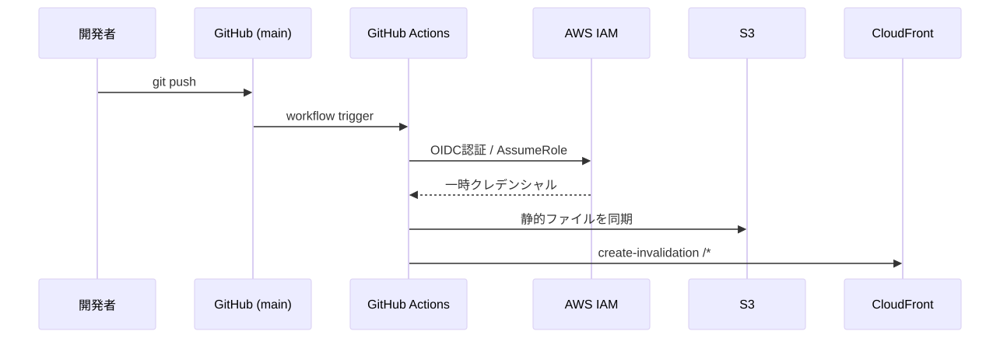

# アーキテクチャ概要

## システム構成図

## リソース一覧

| リソース | 用途 | リージョン |
|----------|------|-----------|
| S3 Bucket | 静的HTMLコンテンツの格納 | ap-northeast-1 |
| CloudFront OAC | S3へのSigV4署名アクセス制御 | グローバル |
| CloudFront Distribution | CDN・HTTPS終端・エッジキャッシュ | グローバル |
| ACM Certificate | TLS証明書 | us-east-1（CloudFront必須） |
| Route53 Hosted Zone | カスタムドメインのDNS管理 | グローバル |
| Route53 A/AAAA Record | apexドメイン → CloudFront Alias | グローバル |
| IAM OIDC Provider | GitHub ActionsのOIDC認証基盤 | グローバル |
| IAM Role | GitHub Actionsのデプロイ用最小権限ロール | グローバル |

## デプロイフロー

